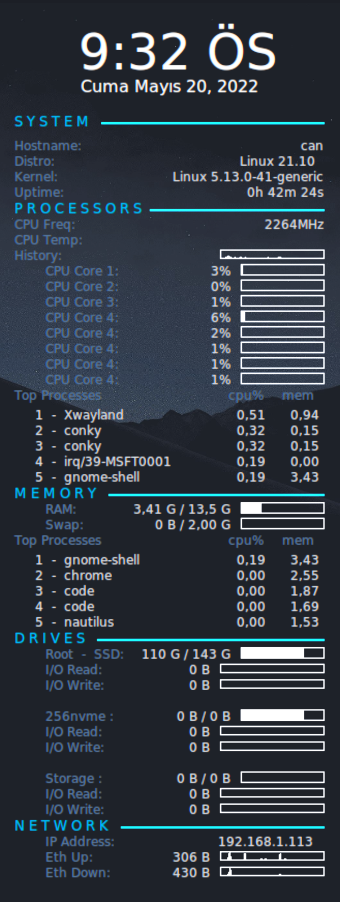

# My Conky Setup for KDE

## How it looks:


---

## To install:

* Install conky on your system if you don't have it already
    ```bash
    $ sudo apt install conky
    ```
* 
    ```bash
    $ cd ~/.conky
    $ git clone https://github.com/cangozpi/titus-conky

    # To run automatically at the boot:
    $ cd /etc/profile.d/
    $ ln -s ~/.conky/conky-startup.sh conky.sh
    ```

---

## Configurations:
* Modify __Titus.conkyrc__ to change its behaviour

* Some of the main parameters are summarized below:
    
    1. _own_window_argb_value_ = 50 --> sets transparency of the background

    2. Add or remove more cpu lines(depending on your device) by changing the cpu numbers (e.g. add a line with cpu9 to add a 9^th cpu)
    ```
    ${color2}${offset 30}CPU Core 1:${color} ${alignr}${offset -10}${cpu cpu1}%${alignr}${cpubar cpu1}
    ${color2}${offset 30}CPU Core 2:${color} ${alignr}${offset -10}${cpu cpu2}%${alignr}${cpubar cpu2}
    ${color2}${offset 30}CPU Core 3:${color} ${alignr}${offset -10}${cpu cpu3}%${alignr}${cpubar cpu3}
    ${color2}${offset 30}CPU Core 4:${color} ${alignr}${offset -10}${cpu cpu4}%${alignr}${cpubar cpu4}
    ${color2}${offset 30}CPU Core 4:${color} ${alignr}${offset -10}${cpu cpu5}%${alignr}${cpubar cpu5}
    ${color2}${offset 30}CPU Core 4:${color} ${alignr}${offset -10}${cpu cpu6}%${alignr}${cpubar cpu6}
    ${color2}${offset 30}CPU Core 4:${color} ${alignr}${offset -10}${cpu cpu7}%${alignr}${cpubar cpu7}
    ${color2}${offset 30}CPU Core 4:${color} ${alignr}${offset -10}${cpu cpu8}%${alignr}${cpubar cpu8}
    ```
    
    3. change the alignment by changing the alignment value to one of the options specified at its right.
    ```
    alignment = 'middle_right',						-- top_left,top_middle,top_right,bottom_left,bottom_middle,bottom_right,
												-- middle_left,middle_middle,middle_right,none
    ```

    4. To change the font size
    ```
    font = 'Roboto Mono:size=9',  				-- font for complete conky unless in code defined
    ```